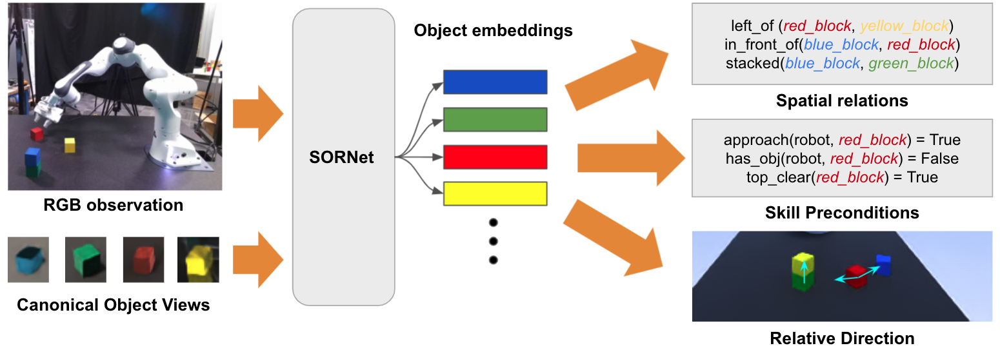

# SORNet: Spatial Object-Centric Representations for Sequential Manipulation
### [[paper]](https://arxiv.org/abs/2109.03891) [[website]](https://wentaoyuan.github.io/sornet) [[clevr data]](https://drive.google.com/drive/folders/1Shgm4IjBYyupu7376uzcs9X7rArm10ui) [[leonardo data]](https://drive.google.com/drive/folders/1YsYkvSTM8rqkyPAmEnbmwu6J6_R4qq2V) [[pretrained models]](https://drive.google.com/drive/folders/1kXPBnQI46VxQfAEqoaCeFLZfRn8HH3at)


## Introduction
SORNet (Spatial Object-Centric Representation Network) is a framework for extracting object-centric representations from RGB observations conditioned on canonical views of the objects of interest. The object embeddings learned by SORNet generalize zero-shot to unseen object entities on spatial reasoning tasks such as spatial relation prediction, skill precondition classification and relative direction regression, significantly outperforming baselines. This repository contains a basic PyTorch implementation for training and evaluating SORNet. Please refer to our [project website](https://wentaoyuan.github.io/sornet) or our [publication at CORL 2021](https://arxiv.org/abs/2109.03891) for more details.

If you find our work useful, please consider citing our paper:
```
@inproceedings{yuan2021sornet,
    title        = {SORNet: Spatial Object-Centric Representations for Sequential Manipulation},
    author       = {Wentao Yuan and Chris Paxton and Karthik Desingh and Dieter Fox},
    booktitle    = {5th Annual Conference on Robot Learning},
    pages        = {148--157},
    year         = {2021}
    organization = {PMLR}
}
```

## Setup
- Install dependencies by `conda env create -f environment.yml`.
- Activate virtual environment by `conda activate sornet`.
- Download data ([clevr](https://drive.google.com/drive/folders/1Shgm4IjBYyupu7376uzcs9X7rArm10ui) and [leonardo](https://drive.google.com/drive/folders/1YsYkvSTM8rqkyPAmEnbmwu6J6_R4qq2V)) and copy or sym link to `data/`.
- Download [pre-trained models](https://drive.google.com/drive/folders/1kXPBnQI46VxQfAEqoaCeFLZfRn8HH3at) and copy or sym link to `models/`.
- Example environment specs (doesn't have to match exactly to run the models):
    - Ubuntu 18.04
    - Pytorch 1.10.0
    - CUDA 11.3

## Experiments
### Spatial Relation Prediction
In this experiment, we ask SORNet to predict spatial relations (left, right, front, behind) between each pair of objects in a scene with up to 10 objects. We use the [CLEVR-CoGenT](https://cs.stanford.edu/people/jcjohns/clevr) dataset, where the training and evaluation data contain different sets of objects. The model has not seen any annotation from the evaluation data.

- To evaluate accuracy of the pretrained model:
    ```
    python test_clevr.py \
        --data data/clevr_cogent \
        --split valB \
        --checkpoint models/clevr_cogent.pth
    ```
    - Use the `--split` flag to switch between `valA` (same set of objects as training) and `valB` (different set of objects from training).

- To visualize the prediction:
    ```
    python visualize_clevr.py 0 left large_red_rubber_cube small_green_metal_sphere \
        --data data/clevr_cogent \
        --split valB \
        --checkpoint models/clevr_cogent.pth
    ```
    - The command syntax is `python visualize_clevr.py [frame_index] [relation] [object1] [object2]`.
    - To see the list of available objects, run the following inside a python interactive shell:
        ```
        import h5py             
        for obj in h5py.File('data/clevr_cogent/objects.h5'):
            print(obj)
        ```

- To train a new model:
    ```
    python train_clevr.py --data data/clevr_cogent --log log/clevr
    ```
    - Multi-GPU training via PyTorch DDP is supported. Use `--n_gpu` to specify the number of GPUs to use for training.
    - Run `tensorboard --logdir log/clevr` to monitor training progress.
    - Use `--resume [checkpoint]` to resume training from a checkpoint.

### Skill Precondition Classification
In this experiment, we ask SORNet to classify preconditions/predicates of a primitive manipulation skill given an RGB image of a manipulation scene. For example, SORNet needs to determine whether the robot has the red block in its hand, i.e. whether the predicate `has_obj(robot, red_block)` is true, before the robot executes the skill `lift(red_block)`.

The pretrained model has not seen any of the test objects. It can also generalize to scenes with different number of objects.

- To evaluate accuracy of the pretrained model:
    ```
    python test_leonardo.py \
        --data_dir data/leonardo \
        --split test_4obj \
        --obj_file test_objects.h5 \
        --n_views 3 \
        --checkpoint models/leonardo_3view.pth
    ```
    - Use the `--split` flag to switch among test sets including 4 (`test_4obj`), 5 (`test_5obj`) and 6 (`test_6obj`) objects.
    - Use the `--n_views` flag to select the number of views (1 or 3) used for evaluation.
    - Pass the `--gripper` flag when evaluating the model taking gripper state as input (e.g. `models/leonardo_gripper_3view.pth`).

- To visualize the prediction
    ```
    python visualize_leonardo.py \
        --data data/leonardo \
        --split test_4obj \
        --obj test_objects.h5 \
        --checkpoint models/leonardo_3view.pth
    ```
    - Use the `--split` flag to switch among test sets (`test_4obj|test_5obj|test_6obj`).
    - Use `--seq_id` and `--frame_id` to choose the sequence and frame to visualize.
    - In the visualization, black predicates are true positives, blue are false positives and red are false negatives.

- To visualize learned attention:
    ```
    python visualize_attention.py \
        --data leonardo \
        --split test_4obj \
        --obj test_objects.h5 \
        --checkpoint models/leonardo_3view.pth
    ```
    - Use the `--split` flag to switch among test sets (`test_4obj|test_5obj|test_6obj`).
    - Use `--seq_id` and `--frame_id` to choose the sequence and frame to visualize.
    - Use `--layer_to_vis` to chosse the layer for which the attention weights are visualized.
    - In the figure, the context patches are color coded by the attention weights from the query patches. Darker indicates more attention.

- To train a new model:
    ```
    python train_leonardo.py --data data/leonardo --log log/leonardo
    ```
    - Use the `--n_views` flag to select the number of views (1 or 3) used to train the model.
    - Pass the `--gripper` flag to train model taking gripper state as input.
    - Multi-GPU training via PyTorch DDP is supported. Use `--n_gpu` to specify the number of GPUs to use for training.
    - Run `tensorboard --logdir log/leonardo` to monitor training progress.
    - Use `--resume [checkpoint]` to resume training from a checkpoint.

### Relative Direction Regression
In this experiment, we train readout networks to regress continuous 3D directions among entities (e.g. the end effector and objects) on top of a frozen embedding network trained on predicate classificaiton. This experiment shows that the object embedding learned by SORNet contains continuous spatial information even though it is trained with no metric supervision.

- To evaluate accuracy of the pretrained model:
    ```
    python test_regression.py \
        --data data/leonardo \
        --split test_4obj \
        --obj_file test_objects.h5 \
        --n_views 3 \
        --model models/leonardo_3view.pth \
        --head_checkpoint models/leonardo_regression_obj-obj_dir_3view.pth
    ```
    - Use the `--dist` flag to test models trained to regress distance instead of unit xyz direction (e.g. `models/leonardo_regression_obj-obj_dist_3view.pth`).
    - Use the `--ee` flag to test models trained to regress quatinties from end effector to objects instead of between pairs of objects (e.g. `models/leonardo_regression_ee-obj_dir_3view.pth`).

- To visualize the prediction:
    ```
    python visualize_regression.py \
        --data data/leonardo \
        --split test_4obj \
        --obj test_objects.h5 \
        --model models/leonardo_3view.pth \
        --dir_head models/leonardo_regression_obj-obj_dir_3view.pth \
        --dist_head models/leonardo_regression_obj-obj_dist_3view.pth
    ```
    - Use the `--split` flag to switch among test sets (`test_4obj|test_5obj|test_6obj`).
    - Use `--seq_id` and `--frame_id` to choose the sequence and frame to visualize.
    - Use `--ee` to visualize models that regress quatinties from end effector to objects.
    - In the figure, the arrows are color coded by the target object and the length is scaled by the predicted distance.

- To train a new model:
    ```
    python train_leonardo.py \
        --data data/leonardo \
        --log log/regression/obj-obj_dir \
        --model models/leonardo_3view.pth
    ```
    - Use `--model [checkpoint]` to specify weights for the pretrained embedding network.
    - Use `--ee` to train models that regress quatinties from end effector to objects.
    - Use `--dist` to train models that regress distance.
    - Multi-GPU training via PyTorch DDP is supported. Use `--n_gpu` to specify the number of GPUs to use for training.
    - Run `tensorboard --logdir log/regression/obj-obj_dir` to monitor training progress.
